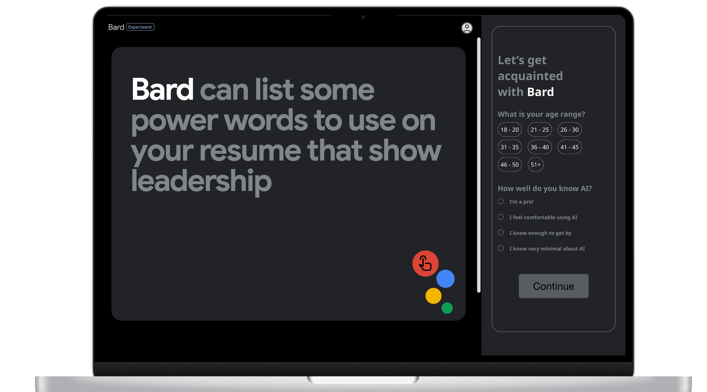

# **SideBard from Team AInsight**
 

## **BrainStation Industry Day with Google**

---

## 🌟 Introduction

Welcome to our team's GitHub repository for the Google Industry Day competition hosted by BrainStation. First I'd like to introduce you to our diverse team of data scientists, UI/UX designers, and web developers:

### 🚀 Our Team

- **Abi Wheeler** (UI / UX)
- **Diane Lu** (Data Science)
- **Jack Speidel** (Web Developer)
- **Maheshi** (Web Developer)
- **Nima Chinikar** (Data Science)
- **Sam Celarek** (Data Science)
- **Tony Lau** (Web Developer)
- **Gem Ruby** (Team Lead and TA)

---

### 🤔 The Challenge

We were given the following problem by Google to solve:

> "How might we educate users of new AI-related features becoming a part of a product, while maintaining user trust and avoiding misunderstandings about AI?"

---

### 💡 Our Solution

    
<h2><strong>Sidebard</strong></h2>

<h3><strong>Sidebard</strong> is a sidebar for all Google Suite Products that are empowered with AI. This sidebar will feature an advanced chatbot that sources information directly from Google's extensive help resources and usage guidelines to answer user queries and elevate their product experience. More than just a tool, it would symbolize Google's commitment to user education and mastery in the era of AI-driven innovations.</h3>

---
### Demonstration of Product

#### See SideBard's Sidebar

Here's a quick demo of our sidebar's aesthetics and we invite you to [Play with SideBard in this Figma Prototype](https://www.figma.com/proto/htu5k0wM0Xg3FJK4vGhh2C/Google---Industry-Project---Workspace?page-id=6%3A3&type=design&node-id=18-212&viewport=-1347%2C379%2C0.56&t=ZOkx9GZUwVS9qznG-1&scaling=min-zoom&starting-point-node-id=18%3A212&mode=design): 

#### Chat with SideBard
Here's a quick demo of the chatbot we customized for this purpose and we invite you to [Chat with SideBard in this jupyter notebook](https://github.com/scelarek/Google-Industry-Day/blob/5b08cff5c46dc07442bb57487b1c55183420c803/SideBard%20Chatbot/Play_with_Sidebard.ipynb) (library dependencies are in [function_source.py](https://github.com/scelarek/Google-Industry-Day/blob/5b08cff5c46dc07442bb57487b1c55183420c803/SideBard%20Chatbot/function_source.py)):

> **Question:**
> How to sum all the costs of this store in sheets?
>
> **Answer:**
> Hello Samir! To sum all the costs of a store in Google Sheets, you can use the SUM function. Here's how you can do it:
> - Select the cell where you want the sum to appear.
> - Type "=SUM(" in the cell.
> - Select the range of cells that contain the costs you want to sum.
> - Close the parentheses ")" and press Enter.
> 
> For example, if the costs are in cells A1 to A10, you would enter "=SUM(A1:A10)" in the cell. This will calculate the sum of all the costs in the specified range and display the result in the selected cell.

#### SideBard's Presentation

Please explore more of our work in this [presentation](https://www.canva.com/design/DAFo7IeXG7Q/DKpUBAYZl6BnwubPshKM3w/view?utm_content=DAFo7IeXG7Q&utm_campaign=designshare&utm_medium=link&utm_source=publishsharelink). You can also find our market research, web app development, figma work, and KPI dashboard using PowerBI in the reference section below. 

---

We appreciate your interest in our project and invite you to explore our work. If you have any questions or feedback, please don't hesitate to reach out to us at this Github or [scelarek@gmail.com](mailto:scelarek@gmail.com).

**Best Wishes,**  
*Team AInsight*

---

### 📚 Directory to Important Resources

- [Presentation](https://github.com/scelarek/Google-Industry-Day/blob/25d528dd0d837df1556b17c82964b20aea0d98db/Google%20-%20Industry%20Project%20-%20Team%207.pdf)
- [Figma Prototype of SideBard](https://www.figma.com/proto/htu5k0wM0Xg3FJK4vGhh2C/Google---Industry-Project---Workspace?page-id=6%3A3&type=design&node-id=18-212&viewport=-1347%2C379%2C0.56&t=ZOkx9GZUwVS9qznG-1&scaling=min-zoom&starting-point-node-id=18%3A212&mode=design)
- [Chat with SideBard](https://github.com/scelarek/Google-Industry-Day/blob/5b08cff5c46dc07442bb57487b1c55183420c803/SideBard%20Chatbot/Play_with_Sidebard.ipynb) (library dependencies are in [function_source.py](https://github.com/scelarek/Google-Industry-Day/blob/5b08cff5c46dc07442bb57487b1c55183420c803/SideBard%20Chatbot/function_source.py)):

#### Other Resources: 
- [Figma File](https://www.figma.com/file/htu5k0wM0Xg3FJK4vGhh2C/Google---Industry-Project---Workspace?type=design&mode=design)
- [Chatbot Creation](https://github.com/scelarek/Google-Industry-Day/blob/41b6693190884a25d7b7ec6194c5ed9ef48c6ebf/SideBard%20Chatbot/Question%20Embedding%20and%20Search.ipynb)
- [Document Dataset Embedding](https://github.com/scelarek/Google-Industry-Day/blob/41b6693190884a25d7b7ec6194c5ed9ef48c6ebf/SideBard%20Chatbot/Document%20Embedding.ipynb)
- [Market Research Document](https://github.com/scelarek/Google-Industry-Day/blob/25d528dd0d837df1556b17c82964b20aea0d98db/Market%20Research/General%20Questions%20about%20AI%20and%20Uses.pdf)
- [KPIs with PowerBI](https://github.com/scelarek/Google-Industry-Day/blob/602753128eae5ddedd29862f191bc5d546b7e698/Market%20Research%20and%20KPIs/google.pbix)
- [Web Developer Work](https://github.com/scelarek/Google-Industry-Day/tree/602753128eae5ddedd29862f191bc5d546b7e698/Web%20Dev%20Folder)
